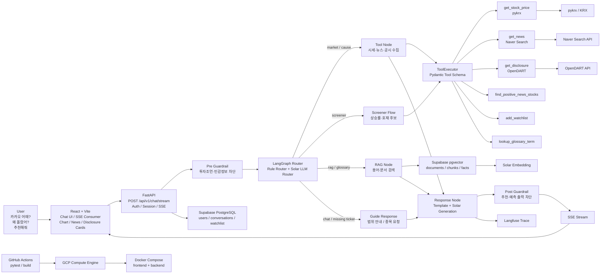

# StockPilot

> 주가·뉴스·공시·재무 데이터를 종합해 종목의 현재 흐름과 변동 원인을 근거 중심으로 설명하는 AI 투자 리서치 Agent

StockPilot은 초보 투자자가 흩어진 주식 정보를 한 번의 질문으로 이해할 수 있도록 돕는 국내 주식 리서치 서비스입니다. 사용자가 “카카오 어때?”, “왜 올랐어?”, “추천해줘”, “공시가 뭐야?”처럼 자연어로 질문하면 시세, 뉴스, 공시, 투자용어/RAG 데이터를 연결해 쉬운 설명과 근거를 제공합니다.

> 주의: StockPilot은 투자 자문 서비스가 아닙니다. 특정 종목의 매수·매도 추천, 손절·익절 판단, 목표가·미래 주가 예측은 제공하지 않으며, 공개 데이터 기반 참고 정보를 제공합니다.

---

## 핵심 기능

| 기능 | 설명 |
|---|---|
| 종목 현황 요약 | 종목명을 입력하면 현재가, 등락률, 일봉 흐름, 관련 뉴스, 최근 공시를 함께 조회합니다. |
| 원인 분석 | “왜 올랐어?”, “왜 떨어졌어?” 같은 후속 질문에서 직전 종목 문맥을 유지하고 뉴스·공시 근거로 설명합니다. |
| 추천/스크리너 | “추천해줘”는 매수 추천이 아니라 최근 상승률·뉴스 근거가 있는 후보 종목 스크리너로 처리합니다. |
| 공시 조회 | OpenDART 기반 최근 공시 목록과 공시 리스크를 조회합니다. |
| 투자용어/RAG | 공시, PER, 상장 등 투자용어와 보고서 청크를 Supabase pgvector에서 검색해 설명합니다. |
| 세션/로그인 | 로그인 사용자의 대화 세션을 Supabase에 저장하고 최근 대화 흐름을 유지합니다. |
| 가드레일 | 매수·매도 추천, 손절·익절 판단, 목표가 예측, 민감정보 입력을 차단합니다. |
| SSE 스트리밍 | `thinking → tool → response → glossary → done` 이벤트를 실시간으로 전송합니다. |
| LLMOps | LiteLLM 폴백, Langfuse tracing, 외부 API timeout/retry를 적용했습니다. |

---

## 대표 대화 흐름

| 입력 흐름 | 동작 |
|---|---|
| `카카오 어때` | 카카오 시세·뉴스·공시 조회 후 요즘 흐름 요약 |
| `카카오 어때` → `왜 올랐어?` | 직전 종목 카카오 문맥 유지 후 상승 원인 분석 |
| `카카오 요즘 어때` → `추천해줘` | 카카오 매수 추천이 아니라 상승률·뉴스 기반 후보 종목 스크리너 실행 |
| `추천해줘` → `왜 올랐어?` | 여러 후보 중 대상이 불명확하므로 “어떤 종목인지 알려달라”고 안내 |
| `삼성전자 매수 추천해줘` | 투자 조언 가드레일로 차단 |
| `공시가 뭐야?` | 투자용어/RAG 기반으로 쉬운 설명 제공 |

---

## 기술 스택

| 영역 | 사용 기술 |
|---|---|
| Backend | Python 3.11, FastAPI, LangGraph, Pydantic, uv |
| Frontend | React 19, Vite, Recharts, React Markdown |
| LLM | Upstage Solar Pro 3, Solar Embedding, LiteLLM fallback |
| Data/API | pykrx, Naver Search API, OpenDART |
| DB/RAG/Auth | Supabase PostgreSQL, pgvector, JWT |
| Observability | Langfuse, loguru |
| Streaming | FastAPI StreamingResponse, SSE |
| Deploy/CI | Docker, Docker Compose, GCP Compute Engine, GitHub Actions |
| Quality | pytest, ruff, frontend build |

---

## 아키텍처

기본 흐름은 LangGraph Router Graph입니다. ReAct는 별도 선택 모드로 구현되어 있으며, 기본 사용자 요청은 Router → Tool/RAG → Response 흐름을 탑니다.



---

## 도구 레이어

| 도구 | 역할 |
|---|---|
| `get_stock_price` | pykrx 기반 현재가, 등락률, 일봉, 재무지표 조회 |
| `get_news` | 네이버 뉴스 검색 API 기반 기업 뉴스 수집 및 방향성 필터링 |
| `get_disclosure` | OpenDART 기반 최근 공시 조회 |
| `find_positive_news_stocks` | 상승률·뉴스 근거 기반 후보 종목 스크리너 |
| `lookup_glossary_term` | Supabase pgvector 기반 투자용어/RAG 검색 |
| `add_watchlist` | 사용자 관심종목 저장 |

---

## 빠른 시작

### 1. 백엔드

```powershell
cd C:\Users\jaesa\OneDrive\Desktop\Upstage\Project\code
uv sync
copy .env.example .env
```

`.env`에 API 키를 채운 뒤 Supabase SQL Editor에서 `data/supabase_schema.sql`을 실행합니다.

```powershell
uv run python data/scripts/ingest_rag.py
uv run uvicorn app.main:app --reload
```

- API 문서: `http://localhost:8000/docs`
- Health check: `http://localhost:8000/api/v1/health/`

### 2. 프론트엔드

```powershell
cd frontend
npm install
npm run dev
```

- Frontend: `http://localhost:5173`

### 3. Docker Compose

```powershell
docker compose up -d --build
```

- Frontend: `http://localhost`
- Backend: `http://localhost:8000`

> 구형 Docker 환경에서는 `docker-compose up -d --build`를 사용하세요.

---

## 환경 변수

주요 환경 변수는 `.env.example`을 기준으로 설정합니다.

| 변수 | 설명 |
|---|---|
| `UPSTAGE_API_KEY` | Upstage Solar/Solar Embedding API Key |
| `LLM_MODEL` | 기본 LLM 모델명. 예: `solar-pro3` |
| `EMBEDDING_MODEL`, `EMBEDDING_DIMENSION` | RAG 임베딩 모델 및 차원 |
| `NAVER_CLIENT_ID`, `NAVER_CLIENT_SECRET` | 네이버 검색 API |
| `DART_API_KEY` | OpenDART API |
| `KRX_ID`, `KRX_PW` | pykrx/KRX 보조 인증 정보 |
| `SUPABASE_URL`, `SUPABASE_KEY` | Supabase 연결 정보 |
| `JWT_SECRET`, `JWT_EXPIRE_MINUTES` | 로그인 토큰 설정 |
| `OPENAI_API_KEY`, `GEMINI_API_KEY`, `ANTHROPIC_API_KEY` | LiteLLM 폴백용 선택 키 |
| `LANGFUSE_PUBLIC_KEY`, `LANGFUSE_SECRET_KEY`, `LANGFUSE_HOST` | Langfuse 관측 설정 |
| `LLM_GUARDRAILS_ENABLED` | LLM 가드레일 활성화 여부 |

---

## RAG / 문서 적재

기본 투자용어 사전 적재:

```powershell
uv run python data/scripts/ingest_rag.py
```

로컬 PDF 문서 적재 예시:

```powershell
uv run python data/scripts/ingest_rag.py ingest-file `
  --path "사업보고서.pdf" `
  --parser upstage `
  --business-report `
  --extract-facts `
  --source-id "business-report:sample" `
  --title "샘플 사업보고서"
```

OpenDART 기반 보고서 캐싱/적재는 `app/services/report_cache.py`, `app/services/document_ingestion.py`, `app/repositories/document_ai.py`를 통해 확장됩니다.

---

## API 요약

모든 경로는 `/api/v1` prefix를 사용합니다.

| Method | Endpoint | 설명 |
|---|---|---|
| `POST` | `/auth/register` | 회원가입 및 JWT 발급 |
| `POST` | `/auth/login` | 로그인 및 JWT 발급 |
| `POST` | `/chat/stream` | SSE 기반 채팅 스트림 |
| `POST` | `/chat/` | 단건 채팅 응답 |
| `GET` | `/conversations/` | 사용자 대화 목록 조회 |
| `PUT` | `/conversations/` | 대화 저장/수정 |
| `POST` | `/conversations/bulk` | 대화 목록 일괄 저장 |
| `DELETE` | `/conversations/{conv_id}` | 대화 삭제 |
| `GET` | `/watchlist/` | 관심종목 조회 |
| `POST` | `/watchlist/` | 관심종목 추가 |
| `DELETE` | `/watchlist/{ticker}` | 관심종목 삭제 |
| `GET` | `/health/` | 서버 상태 확인 |

### SSE 이벤트 타입

| 이벤트 | 설명 |
|---|---|
| `thinking` | 라우팅/도구/RAG 진행 상태 |
| `tool` | 도구 실행 결과 패널 |
| `token` | LLM 토큰 스트리밍 |
| `response` | 최종 또는 템플릿 응답 |
| `glossary` | 응답 내 투자용어 매칭 결과 |
| `error` | 가드레일 또는 처리 오류 |
| `done` | 스트림 종료 |

---

## 평가 결과

| 평가 항목 | 결과 |
|---|---:|
| 전체 회귀 테스트 | 129 / 129 통과 |
| 배포 스모크 테스트 | 6 / 6 통과 |
| 100개 프롬프트 평가 | 98 / 100 통과 |
| 도구 라우팅 평가 | 65 / 65 통과 |
| RAG/용어 설명 평가 | 20 / 20 통과 |
| 범위 밖 질문 처리 | 5 / 5 통과 |

| 응답 속도 지표 | 결과 |
|---|---:|
| 첫 이벤트 평균 응답 | 약 1.2초 |
| 전체 응답 중앙값 | 약 2.5초 |
| 전체 응답 평균 | 약 4.1초 |
| 최장 응답 | 약 17초대 |

> 100개 프롬프트를 대상으로 SSE 요청 시작부터 최종 `done` 이벤트까지의 시간을 측정했습니다. 외부 API를 사용하는 뉴스·공시·스크리너 요청은 네트워크 상황에 따라 지연될 수 있어 SSE 스트리밍, timeout, retry, fallback으로 보완합니다.

---

## 테스트

```powershell
uv run ruff check .
uv run pytest -q
```

주요 테스트 범위:

- 라우터/문맥 처리
- ToolExecutor 및 Pydantic Tool Schema
- RAG/용어 검색
- OpenDART/뉴스/시세 repository
- 가드레일
- LLM fallback
- SSE chat flow
- 인증/세션/관심종목

---

## 배포

- `Dockerfile`: FastAPI 백엔드 이미지
- `frontend/Dockerfile`: Vite build 후 nginx 서빙
- `docker-compose.yml`: backend + frontend 서비스 실행
- `.github/workflows/ci.yml`: backend pytest + frontend build
- `.github/workflows/cd.yml`: GitHub Actions → GCE SSH over IAP → Docker Compose 재배포

CD는 GitHub Secrets에 저장된 API 키와 GCP 인증 정보를 사용해 GCE VM의 `/home/{user}/stockpilot`에 최신 `main`을 pull하고 컨테이너를 재빌드합니다.

---

## 프로젝트 구조

```text
StockPilot/
├─ app/
│  ├─ api/routes/          # auth, chat, conversations, watchlist, health
│  ├─ agents/              # optional ReAct agent mode
│  ├─ core/                # config, prompts, llm fallback, guardrails, observability
│  ├─ graph/               # LangGraph state/nodes/edges/graph
│  ├─ repositories/        # price, news, disclosure, rag, glossary, users, conversations
│  ├─ schemas/             # chat, auth, tool args/results
│  ├─ services/            # document ingestion, report cache
│  └─ tools/               # ToolExecutor, tool registry
├─ data/
│  ├─ glossary.json
│  ├─ supabase_schema.sql
│  └─ scripts/
│     ├─ ingest_rag.py
│     └─ eval_routing_100.py
├─ frontend/
│  └─ src/
├─ tests/
├─ Dockerfile
├─ docker-compose.yml
├─ pyproject.toml
└─ README.md
```

---

## 현재 한계 및 개선 방향

- 외부 API 응답 속도와 데이터 최신성에 따라 결과가 달라질 수 있습니다.
- 스크리너는 제한된 종목 universe를 기준으로 동작합니다.
- “추천해줘”는 투자 추천이 아니라 상승률·뉴스 기반 후보 탐색으로 처리합니다.
- 추후 개선 방향:
  - 더 넓은 종목 universe
  - 공시 리스크 요약 고도화
  - 사용자별 관심종목 기반 개인화
  - Human Evaluation 결과 기반 응답 UX 개선
